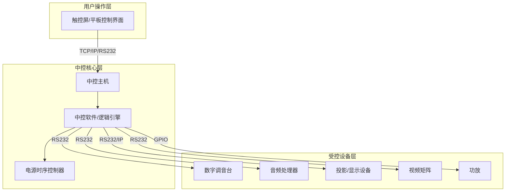

```mermaid
flowchart TD
    subgraph 用户操作层
        UI[触控屏/平板控制界面]
    end
    subgraph 中控核心层
        KZ[中控主机]
        KZV[中控软件/逻辑引擎]
        PWR[电源时序控制器]
    end
    subgraph 受控设备层
        A[数字调音台]
        B[音频处理器]
        C[投影/显示设备]
        D[视频矩阵]
        E[功放]
    end
    UI -->|TCP/IP/RS232| KZ
    KZ --> KZV
    KZV --> PWR
    KZV -->|RS232| A
    KZV -->|RS232| B
    KZV -->|RS232/IP| C
    KZV -->|RS232| D
    KZV -->|GPIO| E
```
