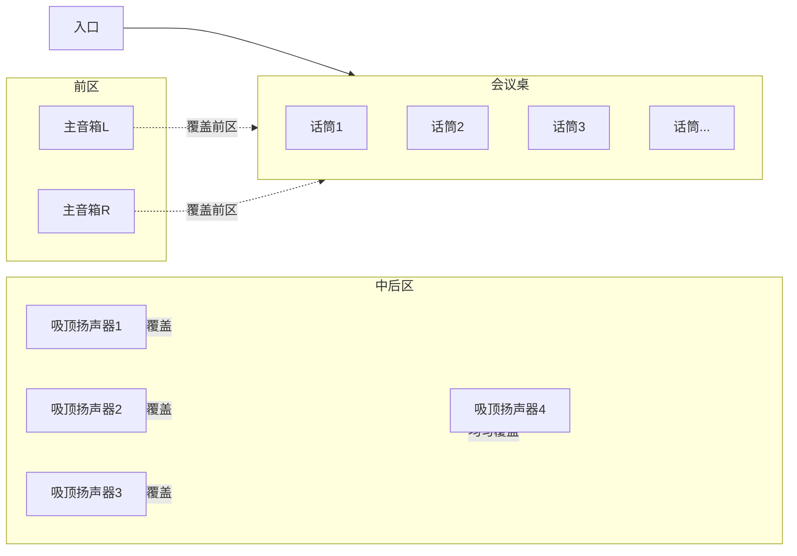

```mermaid
flowchart LR
    subgraph 前区
        S1[主音箱L] 
        S2[主音箱R]
    end
    subgraph 中后区
        C1[吸顶扬声器1]
        C2[吸顶扬声器2]
        C3[吸顶扬声器3]
        C4[吸顶扬声器4]
    end
    subgraph 会议桌
        M1[话筒1]
        M2[话筒2]
        M3[话筒3]
        M4[话筒...]
    end
    入口 --> 会议桌
    S1 -.覆盖前区.-> 会议桌
    S2 -.覆盖前区.-> 会议桌
    C1 -.均匀覆盖.-> 中后区
    C2 -.均匀覆盖.-> 中后区
    C3 -.均匀覆盖.-> 中后区
    C4 -.均匀覆盖.-> 中后区
```
