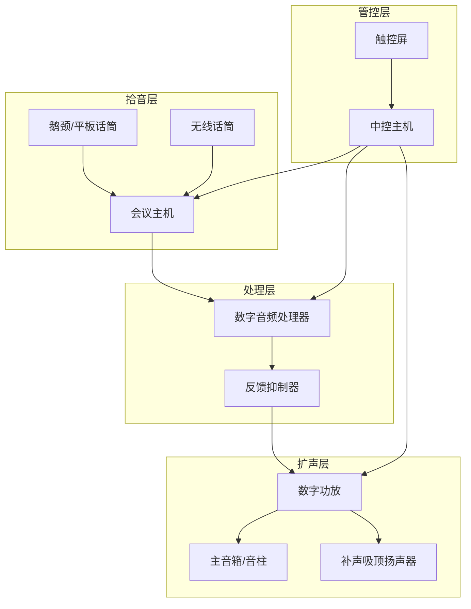

```mermaid
flowchart TD
    subgraph 拾音层
        A1[鹅颈/平板话筒] --> B1[会议主机]
        A2[无线话筒] --> B1
    end
    subgraph 处理层
        B1 --> C1[数字音频处理器]
        C1 --> C2[反馈抑制器]
    end
    subgraph 扩声层
        C2 --> D1[数字功放]
        D1 --> E1[主音箱/音柱]
        D1 --> E2[补声吸顶扬声器]
    end
    subgraph 管控层
        F1[中控主机] --> B1
        F1 --> C1
        F1 --> D1
        G1[触控屏] --> F1
    end
```
